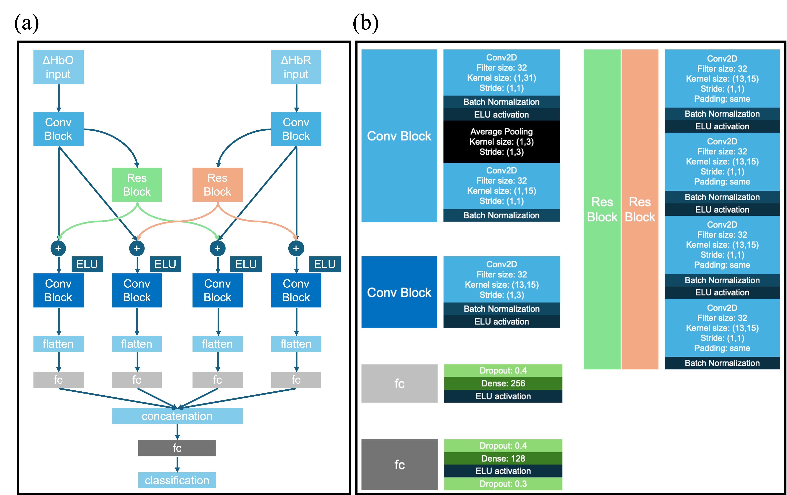

# X-NIRSNet: Novel Deep Learning Architecture Using Cross-Residual Blocks for Decoding Mental States with Functional Near-Infrared Spectroscopy

This repository contains the official PyTorch implementation of **X-NIRSNet**, a deep learning model designed for fNIRS (functional Near-Infrared Spectroscopy) classification tasks.

The model utilizes a **Dual-Stream Architecture** to process HbO (Oxygenated Hemoglobin) and HbR (Deoxygenated Hemoglobin) signals simultaneously.

Due to privacy regulations, the real dataset cannot be released. However, dataset.py automatically generates dummy data with the same dimensions as the real experiment for demonstration purposes.

Input Shape: (Batch_Size, 1, Channels, Time_Points)

Streams: Two parallel streams (e.g., Stream 1 for HbO, Stream 2 for HbR).

Run main.py to start the Leave-One-Subject-Out cross-validation. The code will iterate through all subjects, using one as the test set and the rest for training.

1. Basic Run (Default Settings)

python main.py

2. Custom Experiment
python main.py --channels 13 --fs 6.138 --sec 60 --num_subjects 20 --trials_per_sub 40

| Argument | Default | Description |
| :---: | :---: | :---: |
| `--channels` | `13` | Number of fNIRS channels |
| `--fs` | `6.138` | Sampling rate (Hz) |
| `--sec` | `60` | Duration of each trial (seconds) |
| `--num_subjects` | `10` | Total number of subjects (for dummy generation) |
| `--trials_per_sub` | `20` | Number of trials per subject |
| `--batch_size` | `16` | Batch size for training |
| `--lr` | `0.001` | Learning rate |
| `--epochs` | `50` | Number of training epochs per fold |
| `--seed` | `912` | Random seed for reproducibility |
